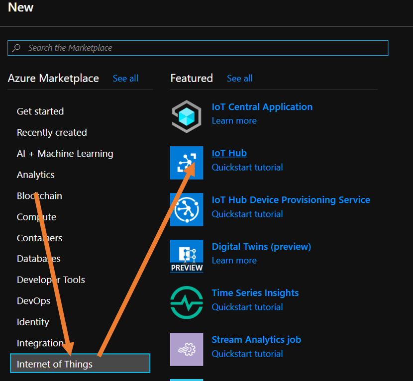
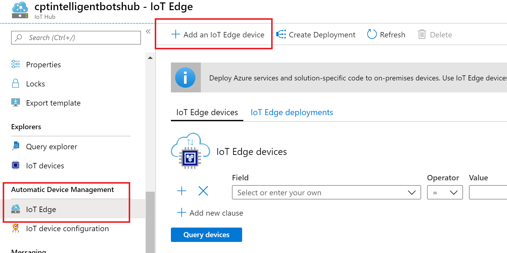

# Lab 2

## Overview
Introduction to developing using an IoT Edge device and interacting with Microsoft's Azure Services. This session is to get he attendees up to speed with the process of interacting with more complex hardware and some basics around Azure and AI / Cognitive services.

# Agenda
| Time | Topic |
|-----|-----|
|8:30 | Registration and welcome
|9:00  to 13:00 | Hands on labs
|13:00 to 13:30 | Lunch
|13:30 to 16:15 | More hands on labs
|16:15 to 16:30 | Wrap up / demos / feedback

## Hands on labs:
- [Requirements](#requirements) 
- [Labs](#labs)

## Requirements
To install and configure your system you need the following:
 - [VSCode](https://code.visualstudio.com/Download)
    - [Azure IoT Tools](https://marketplace.visualstudio.com/items?itemName=vsciot-vscode.azure-iot-tools)
    - [Azure IoT Edge](https://marketplace.visualstudio.com/items?itemName=vsciot-vscode.azure-iot-edge)
    - [Docker Extension](https://marketplace.visualstudio.com/items?itemName=ms-azuretools.vscode-docker)
    - [Remote Development Extension](https://marketplace.visualstudio.com/items?itemName=ms-vscode-remote.vscode-remote-extensionpack)

 - [Docker](https://www.docker.com/products/docker-desktop)
 - Azure Subscription
 - [Putty](https://putty.org)

## Labs

## Testing your Bot 

1.  Plug in the provided Raspberry Pi
2.  SSH (using Putty or Visual Studio Code) in Raspberry Pi.   Use the host name provided with the pi.  (user name and password to be provided)
3.  In the /home/pi/Alphabot2/python folder, run the Joystick.py app to test your bot.  (python Joystick.py)

### Create a IoT Hub instance
1. Login to your Azure Portal and create a resource group
2. Create a new IoT Hub

Follow the steps, by selecting the subscription and giving it a unique name. On the next blade, under "Pricing and scale tier" select "Standard" and create your new IoT Hub
3. Create a new Azure Container Registry (ACR)

Take note to **Enable** the Admin user and select **Basic** pricing SKU
4. When the ACR has completed, navigate to it and then select the **Access keys** blade and take note of the login server, admin user and the password
5. Add **New IoT Edge** Device to previously created Azure IoT Hub.    

6.  Take note of the **connection string** of the device

### Test IoT Runtime on Raspberry Pi

1.  Configure **config.yaml** on the Raspberry Pi.   sudo nano /etc/iotedge/config.yaml
2.   Add previously noted **connection string**  for IoT Edge Device in **config.yaml**

3.  Save file in **Nano** using ctrl-X (Yes to any questions)
4.   Restart IoT Runtime -  "sudo systemctl restart iotedge"
5.   Check status of modules -  "iotedge list"  from the Raspberry Pi command via SSH      [Troubleshooting steps](https://docs.microsoft.com/en-us/azure/iot-edge/troubleshoot)

### Create the computer vision model
1. Log into [Computer Vision](https://www.customvision.ai/) site with the same credentials as your Azure account
2. Create a new project setting the values accordingly

|Property|Value|
|----|----|
|Name | Enter a name for your project
|Resource | Select **create new** and create a new resurce in your Azure account putting it in the same resource group as you IoT hub |
|Project Type | Classification
|Classification Type | Multiclass ( Single tag per image)
|Domain | General (compact)
|Export Capability | Basic platforms

3. When the project is created, add the following **Tags** by selecting the "Plus" on the left hand side of the "Train Images" page:
   - Reverse
   - Forward
   - Left
   - Right
   - Stop
4. Make direction instructions with drawn cards or hand signs and take pictures of it to indicate movement of the bot and upload them by selecting the  **Add Images** button and tag then accordingly. 
_Note you need at least 5 images for each tag._
5. When you have sufficient images for each of the actions, select **Train** and perform a **Quick Train**
6. On completion, evaluate the results. At this stage you can also perform a "Quick test" by uploading a picture that was not used in the training set, and see if it evaluates as expected
7. Select **Export** and select to export a **Dockerfile**. When prompted select "ARM (Raspberry PI)" as the version and click **Export** and then **Download**
8. Extract the downloaded file into the **ImageClassifierService** folder under the code path from the next section 

### Deploy IoT Edge modules
1. Download the code from the location that has been provided by a proctor and open it in VSCode
2. The **.env** file and fill in the values accordingly:

|Property|Value|
|----|----|
|CONTAINER_REGISTRY_ADDRESS | Login Server Name|
|CONTAINER_REGISTRY_USERNAME | Admin user name|
|CONTAINER_REGISTRY_PASSWORD | Password |

3. Right click on the "deployment.template.json" file and select **Build and Push IoT Edge Solution**
4. Grab some coffee
5.  Right click on the "config\deployment.json" file and select **Configure Deployment for Single Device** 
6.   Choose the device connected to the **IoT Hub**
7.  On the Raspberry Pi via SSH.   Restart IoT Runtime (for speed) -  "sudo systemctl restart iotedge" 
8.  Observe the containers starting via "iotedge list" on the Raspberry Pi
9.  Once running check the camera stream via http://YourRaspberryPiIpAdress:5012

